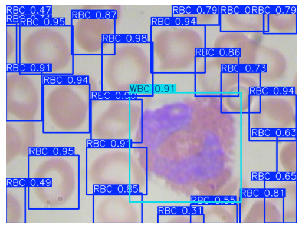

# Blood Object Detection with YOLO

Detecting and classifying blood cells — Red Blood Cells (RBC), White Blood Cells (WBC), and Platelets — in microscope images using YOLOv5 and YOLOv8.

## Overview

This project trains [Ultralytics](https://docs.ultralytics.com/) YOLO models to
locate and label three types of blood cells in blood-smear images. The raw
annotations come as a CSV of bounding boxes (`filename, class, x1, y1, x2, y2`);
the notebooks convert them to the normalized YOLO label format, split the images
80/20 into train/validation sets, and train two model variants (`yolov5n` and
`yolov8n`) for comparison.

It was built as a university object-detection assignment. The trained nano models
reach ~0.93 mAP@50 on the validation set.

## Results

Validation metrics after 15 epochs at 640×640:

**YOLOv5n**

| Class     | Precision | Recall | mAP@50 | mAP@50-95 |
|-----------|-----------|--------|--------|-----------|
| all       | 0.860     | 0.913  | 0.928  | 0.642     |
| RBC       | 0.781     | 0.854  | 0.901  | 0.653     |
| WBC       | 0.980     | 0.987  | 0.975  | 0.768     |
| Platelets | 0.819     | 0.897  | 0.909  | 0.506     |

**YOLOv8n (all classes):** Precision 0.850 · Recall 0.913 · mAP@50 0.925 · mAP@50-95 0.636

Sample prediction on a validation image:



Training curves and the confusion matrix are in `yolov8_results/`
(`results.png`, `confusion_matrix.png`, `BoxPR_curve.png`).

## Tech stack

- **Python** (Jupyter notebooks)
- **Ultralytics YOLO** (YOLOv5n, YOLOv8n)
- **OpenCV** — image reading and box normalization
- **Matplotlib** — visualizing predictions
- **kagglehub** — downloading the dataset

## Dataset

3 classes (`RBC`, `WBC`, `Platelets`), 364 images split into 291 train / 73
validation. The images and annotations are hosted on Kaggle and are not stored in
this repository. Download them with `kagglehub`:

```python
import kagglehub
path = kagglehub.dataset_download("omarelhakim0/blood-object-detection")
```

The dataset layout expected by training is described in `dataset/data.yaml`.

## Getting started

Prerequisites: Python 3.9+.

```bash
pip install -r requirements.txt
```

## Usage

The full workflow lives in the notebooks under `notebooks/`:

- `yolo-V5.ipynb` — train and evaluate YOLOv5n
- `yolo-V8.ipynb` — train and evaluate YOLOv8n

Each notebook (1) builds the YOLO dataset from `data.csv` + `images/`, (2) trains,
and (3) runs a prediction on a validation image. The core training call:

```python
from ultralytics import YOLO

model = YOLO("yolov8n.pt")
model.train(
    data="dataset/data.yaml",
    epochs=15,
    imgsz=640,
    project="blood_cell_project",
    name="yolov8_run",
)
metrics = model.val()
print(f"mAP50: {metrics.box.map50}")
```

## Project structure

```
notebooks/
  yolo-V5.ipynb      # Train and evaluate YOLOv5n
  yolo-V8.ipynb      # Train and evaluate YOLOv8n
  oldYolo.ipynb      # Earlier end-to-end notebook
docs/
  Training Report.pdf  # Write-up of the experiment
  report.txt           # YOLOv5 validation metrics
  output.png           # Example prediction
dataset/data.yaml    # YOLO dataset config (3 classes)
data.csv             # Source bounding-box annotations
yolov8_results/      # Training curves, confusion matrix, metrics
```

## License

Released under the [MIT License](LICENSE).
